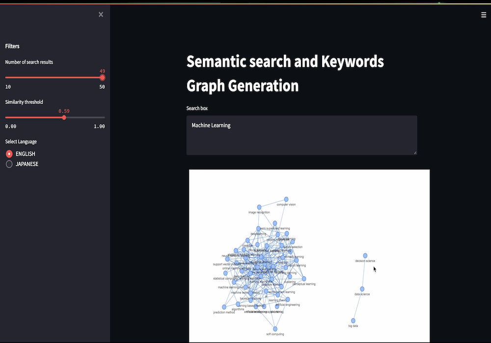
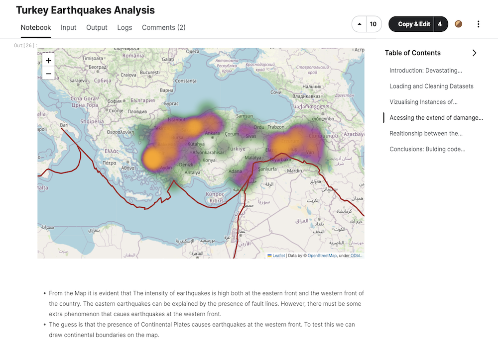
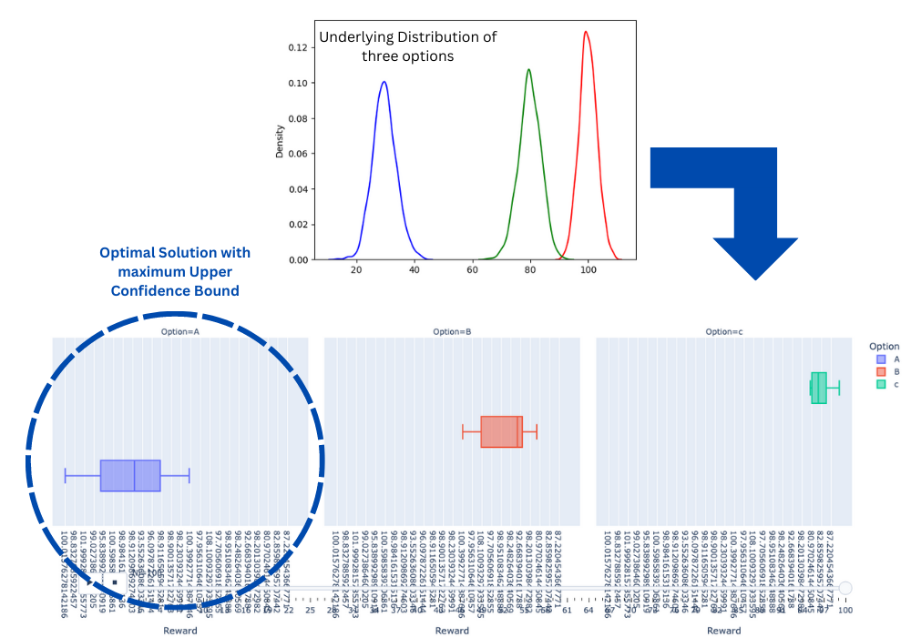
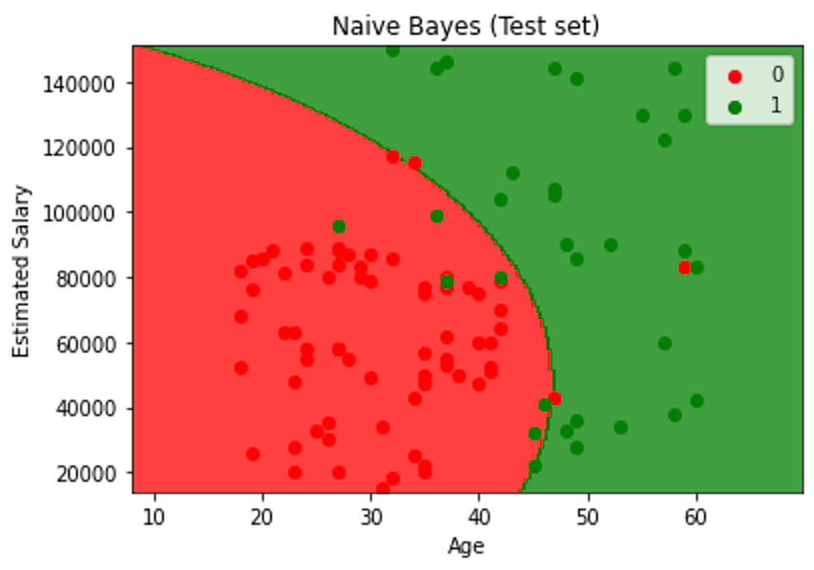
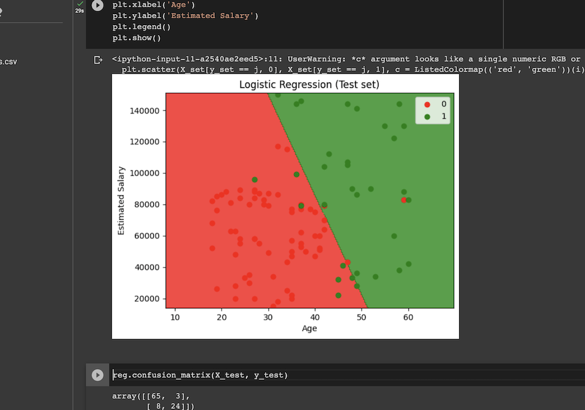

## Portfolio

---

### Applications
[Semantic Search and Keyword Knowledge Graph](/sample_page) 
NLP
 
Shows underlying correlation patterns between various research fields and researchers in major Universities of Japan in the form a graph networks. The projects deal with multi lingual data including English and Japanese. It was built on top of pretrained BERT model from HuggingFace and Facebook’s FIASS indexing. 

---
[Geo-Spatial Analysis of Earthquakes in Turkey](/sample_page) 
Looks at the historic earthquake data, uses geospatial analysis to theorise the origin of earthquakes,  and recommends most vulnerable  districts in Turkey. 

---

### Algorithm Implementations

[Upper Confidence Bound Implementation Fom Scratch](http://example.com/) 
Based on the assumption that given a set of possible options each option has an underlying normal distribution, Upper Confidence Bound Strategy is coded from scratch to choose the optimal option without knowing those distribution, with minimal exploration, and maximum exploitation. This algorithm is useful in a wide variety of problems such as marketing, drug efficacy, and recommender systems. 

---
[Naive Bayes Implementation From Scratch](example.com) 
From scratch implementation of Naive Bayes Classification Algorithm. Classifies a given set of datapoints into a certain number of classes. 

---
[Logistic Regression From Scratch](example.com) 
From scratch implementation of Logistic Regression Classification Algorithm. Also, includes built it visualisation and validation functions. 

