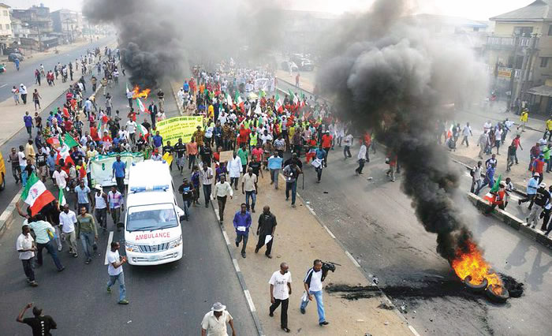
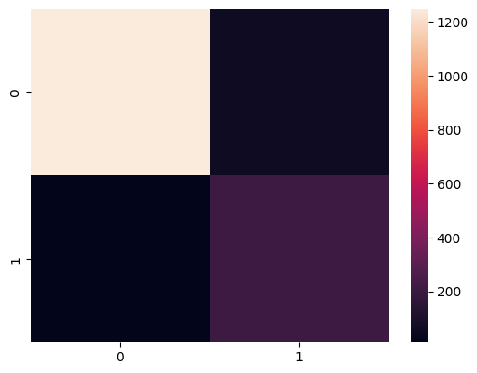

# Modeling Violent Conflicts
<span style="background-color: #daf59f; color: #ffffff; padding: 0.5px 7px; border-radius: 5px;">Support Vector Machine (SVM)</span>
<span style="background-color: #8abceb; color: #ffffff; padding: 0.5px 7px; border-radius: 5px;">Deep Learning</span>
<span style="background-color: #f59faf; color: #ffffff; padding: 0.5px 7px; border-radius: 5px;">Random Forest Classifier</span>
<span style="background-color: #eb8a8a; color: #ffffff; padding: 0.5px 7px; border-radius: 5px;">Data Cleaning</span>
<span style="background-color: #8aebe1; color: #ffffff; padding: 0.5px 7px; border-radius: 5px;">Feature Engineering</span>
<span style="background-color: #ba9ff5; color: #ffffff; padding: 0.5px 7px; border-radius: 5px;">Scikit Learn</span>
<span style="background-color: #eb8ad0; color: #ffffff; padding: 0.5px 7px; border-radius: 5px;">Tensorflow</span>
<span style="background-color: #bb8aeb; color: #ffffff; padding: 0.5px 7px; border-radius: 5px;">Keras</span>




This project shows Shahiryar's commitment, creativity, and orginallity in ideation and implmentation of a project that addresses a pressing real-world-problem.

## Problem Statement
The objective of this project is to develop a predictive model to determine the likelihood of conflicts, civil unrest, or political violence in a country. 
By analyzing historical data and various socio-economic, political, and demographic factors, 
the model aims to provide early warning indicators and insights that can help policymakers and organizations
proactively address potential conflicts.

## Motivation
The cost associated with the conflicts are substantial. Therefore, it is important to use creative ways to look at conflicts in order to not just understand it but to model it, address the root causes, and control conflicts even before they become violent. My country, has been under constant pressure of political conflicts and violence. This model is an attempt to model conflict generally and uncover the underlying socio-economic factors.

## Results
Random Forest Classifier gave the best results on three evaluation metrics namely: Accuracy Score, Recall Score, and F1 Score.
The confusion matrix below shows predictions on test dataset:



Three types of machine learning algorithms were tried viz
1. Support Vector Machine: `sklearn.svm.SVC`
2. Random Forest Classifier `sklearn.ensemle.RandomForestClassifier`
3. Artificial Neural Network `tensorflow.keras.Sequential`

SVM gave an accuracy close to 85% however the `recall` score was dimally low: around 50%
Meanwhile, Deep Learning Sequential Model could not produce a good *recall score* as the *confusion matrix* showed a low __True positive (TP)__.
Although, the sequential model was good at classifying a __Negative__ (high __True Negative (TN)__). This could be because of *distribution* of dataset which has more datapoints with __Negative__ classes. Improving the distribution could alliviate this issue.

Finally, the model with best accuracy and recall is the Random Forest Model. The evaluation metrics are shown below.
```python
from sklearn.metrics import accuracy_score, recall_score, f1_score

print("For Base Random Forest Classification model")
print("Accuracy score: ",accuracy_score(y_test, y_pred))
print("Recall : ",recall_score(y_test, y_pred))
print("f1 score : ", f1_score(y_test, y_pred))
```
```Bash
For Base Random Forest Classification model
Accuracy score:  0.9579776756401839
Recall :  0.7954545454545454
f1 score :  0.8677685950413222
```
## Data
### Data Sources
1. [World Bank Group Data Bank: for socio-politico-economic data](https://databank.worldbank.org/)
2. [ACLED: for conflict data](https://acleddata.com/curated-data-files/#aggregated)
3. [Uppsala Conflict Data Program, Dept of Peace and Conflict](https://ucdp.uu.se/)
### Data Used:
Features required are as follows:
> Socio-Economic Indicator
* Year
* GDP
* Gini Coef
* Literacy Rate
* health indicators
* infrstructure development
* employment level
* percent of labor force by total population
* dependency ratio
* income level
* per captia income
* umemployment rate

> Political Idicators
* World Wide Governance Indicator
* Democracy Index
* poltical Instability Task Force

> Demographic
* Ethnic/Religion make up
* population density
* urbanisation rate
* size of middle class 
* migration patterns
* age structure (middle quantile)

> Environmental
* per captia water availabilty
* deforestation rate
* Climate change impact
* natural disaster

> Conflict Related
* Type of Conflict/unrest
* Casualities
* number of conflicts (in the year under review)

